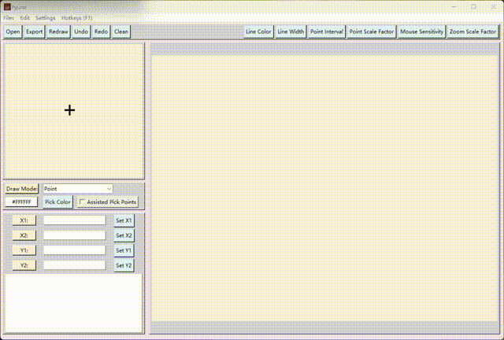

# PyLine
一个用于提取图像中曲线数据的工具。

A tool used for picking points/lines data from images.

## What can PyLine do?
一系列的功能用于从图像中提取曲线数据，包括设置曲线类型，绘制方法和**自动辅助提取点**功能。

A series of functions are used to extract data points from the curve on images, including setting the line type, drawing method and the key **auxiliary automatic picking points** function.

## A simple demo

[Demo Vedio](./images/demo.mp4)

