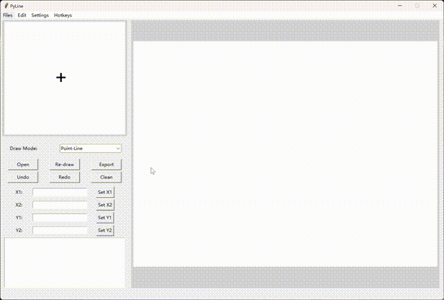
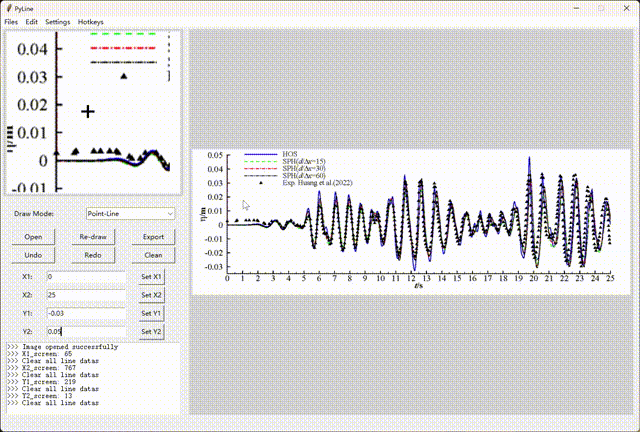
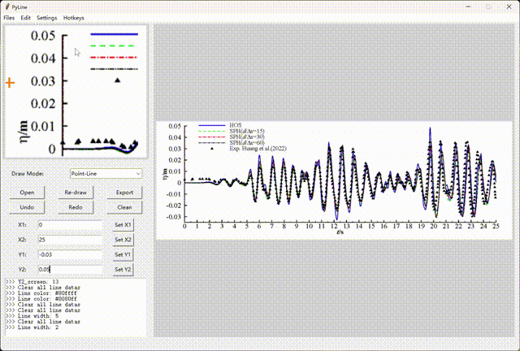
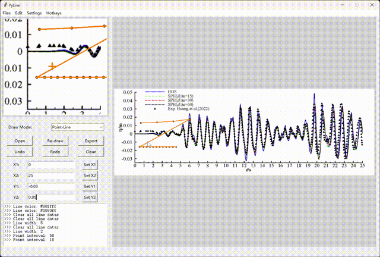
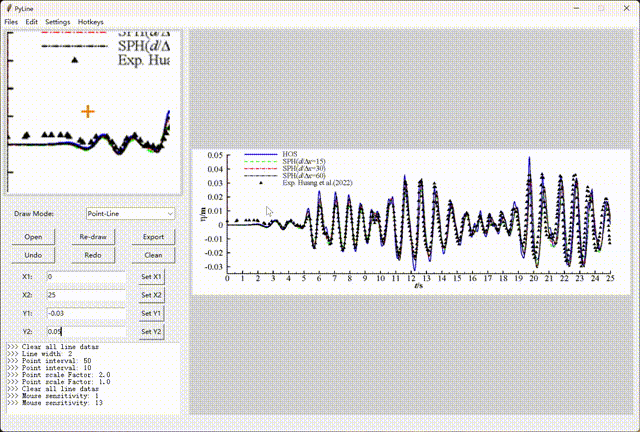
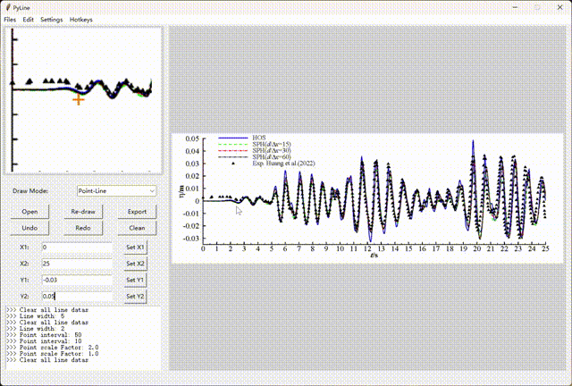
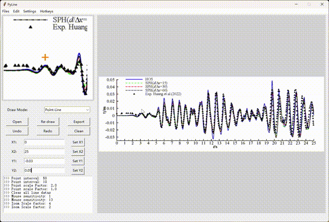
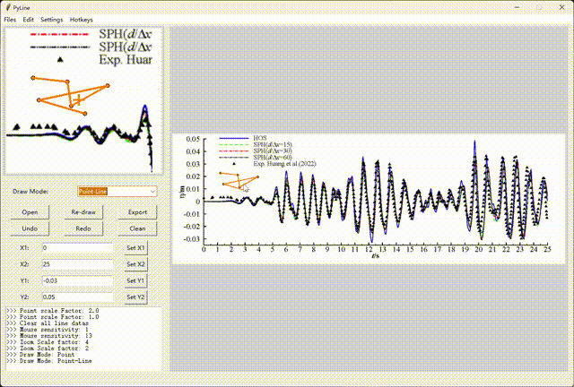
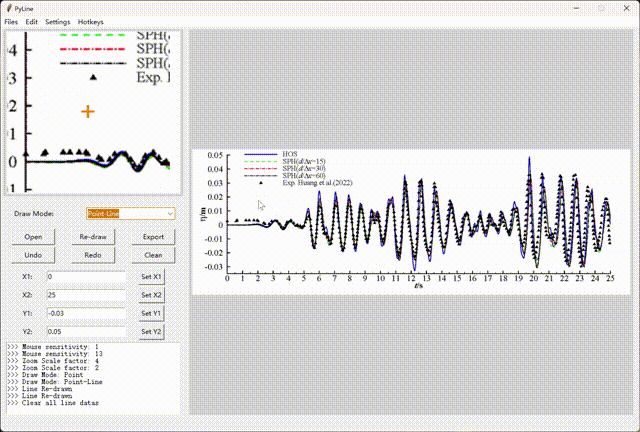

# PyLine
A tool used for picking points/lines data from images.

## What can PyLine do?
- Set axis based on points on the image
- Pick points on the image and draw lines
- Set draw mode (point or point-line)
- Sort all points by X-axis
- Undo and redo
- Clear all points
- Set color, width of line and point
- Set point interval
- Set zoom scale
- Set mouse sensitivity

## A simple demo

### Set axis

### Set color, width of line and point

### Set point interval and point scale

### Set zoom scale

### Set mouse sensitivity

### Set draw mode

### Redraw lines

### Undo and redo
